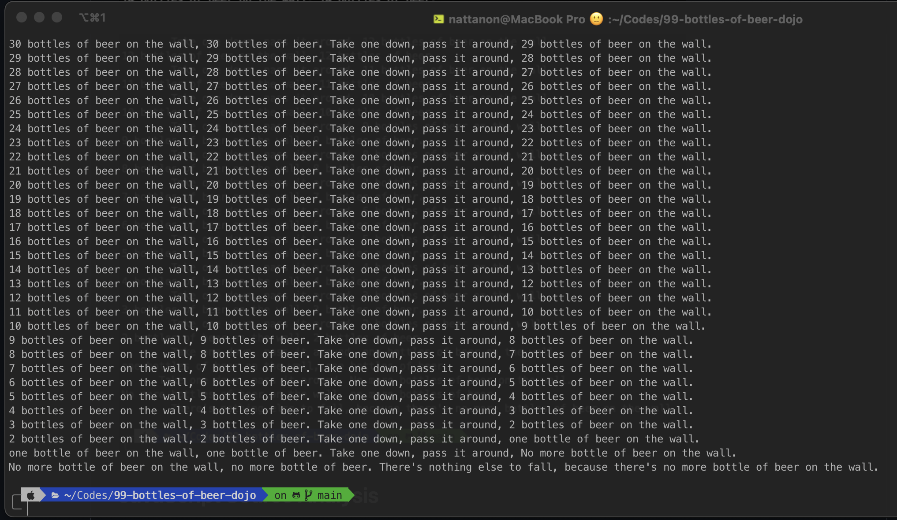

# 99-bottles-of-beer-dojo
## Install

```
git clone https://github.com/aef-nattanon/99-bottles-of-beer-dojo.git
cd 99-bottles-of-beer-dojo
npm install
```

## Start
```
npm start
```



## JavaScript Source Analysis
```
npm install -g plato
plato -r -d report src
open report/index.html # for zsh
```

